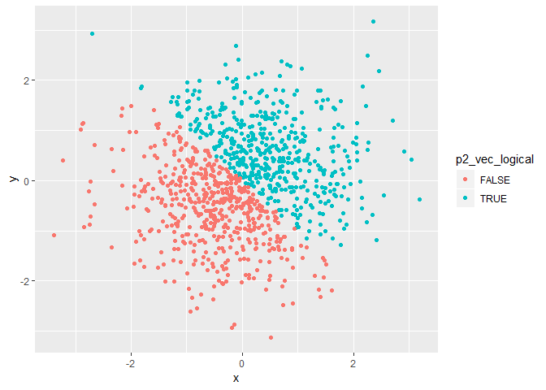
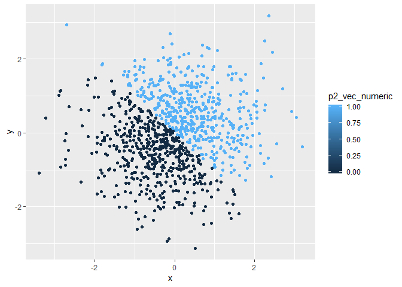

p8105\_hw1\_yh3094
================
Yun He
September 16, 2018

Problem 1
=========

Create a data frame
-------------------

The chunk below creates a data frame with different variable types and tests the function `mean()`.

``` r
p1_df = tibble(
  vec_numeric = runif(10, 0, 5),
  vec_logical = vec_numeric > 2,
  vec_char = c("I", "am", "now", "creating", "a", "vector", "whose", "length", "is", "10"),
  vec_factor = factor(c("Female", "Male", "Male", "Male", "Male", "Male", 
               "Female", "Female", "Female", "Female"))
)

mean(p1_df$vec_numeric)
```

    ## [1] 3.841106

``` r
mean(p1_df$vec_logical)
```

    ## [1] 0.9

``` r
mean(p1_df$vec_char)
```

    ## Warning in mean.default(p1_df$vec_char): argument is not numeric or
    ## logical: returning NA

    ## [1] NA

``` r
mean(p1_df$vec_factor)
```

    ## Warning in mean.default(p1_df$vec_factor): argument is not numeric or
    ## logical: returning NA

    ## [1] NA

### Comment on the results

When taking the mean of each variable in my dataframe, it works for numeric and logical factors, and doesn't work for character and factor vectors. Because regarding the `x` in the function `mean(x, ...)`, it says currently there are only methods for numeric/logical vectors and date, date-time and time interval objects.

Application of the `as.numeric` function
----------------------------------------

The chunk below applies the `as.numeric` function to the logical, character, and factor variables.

``` r
as.numeric(p1_df$vec_logical)
as.numeric(p1_df$vec_char)
as.numeric(p1_df$vec_factor)
```

### Comment on the results

The logical and factor vectors can be converted to numeric vectors, while the character vector can't. Because the `as.numeric` function is to interpret objects as numbers.

Convert Variable types
----------------------

The chunk below converts the character variable from character to factor to numeric, and converts the factor variable from factor to character to numeric.

``` r
as.numeric(as.factor(p1_df$vec_char))
```

    ##  [1]  5  3  8  4  2  9 10  7  6  1

``` r
as.numeric(as.character(p1_df$vec_factor))
```

    ## Warning: NAs introduced by coercion

    ##  [1] NA NA NA NA NA NA NA NA NA NA

### Comment on the results

The character variable can be converted from character to factor to numeric, while the factor variable can't be converted from factor to character to numeric. Because character vectors can't be converted to numeric vectors.

Problem 2
=========

Create a data frame
-------------------

The chunk below creates a new data frame for problem 2.

``` r
set.seed(1234)

p2_df = tibble(
  x = rnorm(1000),
  y = rnorm(1000),
  p2_vec_logical = (x + y) > 0,
  p2_vec_numeric = as.numeric(p2_vec_logical),
  p2_vec_factor = as.factor(p2_vec_logical)
)
```

Describe vectors using inline R code
------------------------------------

The size of the dataset `p2_df` is 1000 rows and 5 columns. The mean and median of `x` is -0.0265972 and -0.0397942, respectively. The proportion of cases for which the logical vector is TRUE is 0.5.

Make scatterplots of `y` vs `x` with color points using different variable types
--------------------------------------------------------------------------------

The chunk below makes a scatterplot of `y` vs `x` with color points using the logical variable.

``` r
yx_scatter_logical = ggplot(p2_df, aes(x, y, color = p2_vec_logical)) + geom_point()
yx_scatter_logical
```



The chunk below makes a scatterplot of `y` vs `x` with color points using the numeric variable.

``` r
yx_scatter_numeric = ggplot(p2_df, aes(x, y, color = p2_vec_numeric)) + geom_point()
yx_scatter_numeric
```



### Comment on the color scales

Different colors of points from dark blue to light blue represent different values of the numeric variable from 0.00 to 1.00, respectively. The numeric variable is converted from the logical variable which is either TRUE or FALSE for the logical expression 'x + y &gt; 0'. So, the dark blue point means the value of the numeric variable is 0.00, which also means the logical variable is FALSE, ie. x + y &lt;= 0. And the light blue point means the value of the numeric variable is 1.00, which also means the logical variable is TRUE, ie. x + y &gt; 0.

The chunk below makes a scatterplot of `y` vs `x` with color points using the factor variable.

``` r
yx_scatter_factor = ggplot(p2_df, aes(x, y, color = p2_vec_factor)) + geom_point()
yx_scatter_factor
```


### Comment on the color scales

The factor variable is also converted from the logical variable which is either TRUE or FALSE for the logical expression 'x + y &gt; 0'. The red point in the plot above represents the value of the factor variable is FALSE, which also means the logical variable is FALSE, ie. x + y &lt;= 0. The green point represents the value of the factor variable is TRUE, which also means the logical variable is TRUE, ie. x + y &gt; 0.

Export the first scatterplot
----------------------------

The chunk below exports the first scatterplot to my project directory using `ggsave`.

``` r
ggsave("yx_scatter_logical.pdf", plot = yx_scatter_logical)
```

    ## Saving 7 x 5 in image
